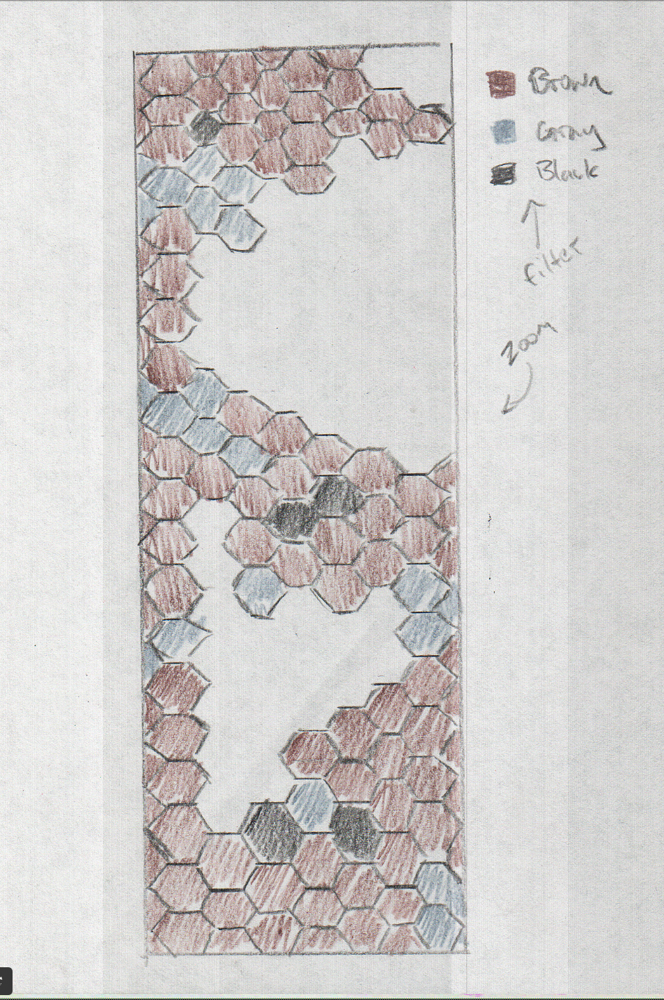
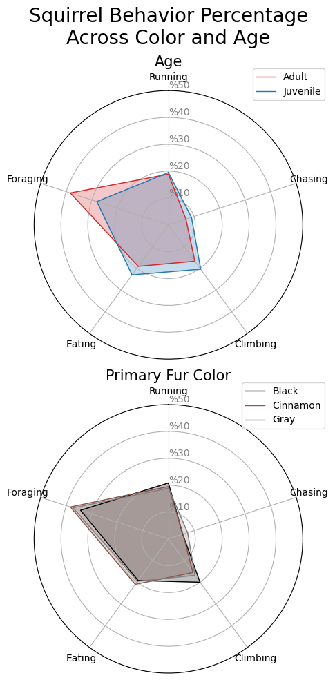

## Introduction

This writeup contains my journey designing, implementing, and evaluating a visualization for the purpose of learning the reasons behind visualization design and how to implement those choices. I also thoroughly evaluate my final product on several test subjects to see if it is effective in communicating the data.

Full source code can be found at my GitHub [here](https://github.com/luckym1/MS-DS_DTSA-5304)

## Goal

Allow users to gain insights from 2018 Central Park Squirrel Census data.

## Data

I choose to use the [2018 Central Park Squirrel Census](https://data.cityofnewyork.us/Environment/2018-Central-Park-Squirrel-Census-Squirrel-Data/vfnx-vebw) data from City of New York website. It has a little over 3000 entries in a csv format. There are 31 column fields but some of the key (and funny) ones are the "X" and "Y" (longitude and latitude) coordinates of the squirrel siting, and "Unique Squirrel ID" as well as information about the squirrel, to include, "Age" and "Primary Fur Color" and boolean flags describing the action of the squirrel to include "Kuks", "Tail Twitches", and "Runs From".

Apart from having a funny data set to work with, my goals for working with this data set are to see if I can answer some questions that immediately come to mind when looking at this data set. These are:

- Are there differences in actions from adult and juvenile squirrels?
- Do different color of squirrels cluster together?
- Do different colors of squirrels have similar or different activities?

There is already an [interactive visualization](https://data.cityofnewyork.us/Environment/2018-Squirrel-Census-Fur-Color-Map/fak5-wcft) for this data that is linked at the same website as the data. It is an interactive map that shows the locations of these data points within central park and also their fur color. This visualization is actually pretty good and shows the whole data set, lets you zoom in, and then gives you details when you hover over the mark. The only thing that could be improved is if there was details on the activity of the squirrel siting when hovering over the mark.

## Tasks

I took the questions I had and turned them into tasks that I could use to design my visualization.

### 1. Compare favored activities of adult and juvenile squirrels

Explore data to see if there is a difference in adult and juvenile squirrel actions by relating age and activity categories. This is shown by ranking most to least common actions (percentage of activities conducted) and using the relative reference comparing between age and actions. This is intended for (amateur) squirrel scientists or general public to use the raw data to create outcomes and show differences between adult and juvenile squirrels.

### 2. Compare favored activities of different color of squirrels

Explore data to see if there is a difference in cinnamon, gray, and black squirrel actions by relating color and activity categories. This is shown by ranking most to least common actions (percentage of activities conducted) and using the relative reference comparing between color and actions. This is intended for (amateur) squirrel scientists or general public to use the raw data and use the outcomes show differences between cinnamon, gray, and black squirrels.

### 3. View distance relationships and clustering of squirrels based on color

Explore data to see if there is a clustering of cinnamon, gray, and black squirrels together. This is shown by organizing sightings by location and highlight color and counting the highest amount of sightings per color in a hexagonal unit taken from the latitude and longitude of sightings as well as the color of the squirrels. This is intended for (amateur) squirrel scientists or general public to use the raw data and use the outcomes show if similar colored squirrels tend to stay close together and where those areas in the park are to guide further squirrel research areas.

### Design for Tasks 1-2

The design for tasks 1 and 2 are similar. I will be using a radar plot to show the relative reference between the different categories. The categories will be the different actions and the different colors or ages. The radar plot will show the percentage of each action for each color or age. The radar plot will be interactive so that when you hover over the different categories, it will highlight the category and show the percentage of that category for each action. This will allow the user to see the relative reference between the different categories and actions.


### Design for Task 3

The design for task 3 is a hexbin plot. The hexbin plot will show the density of the different colors of squirrels. The hexbin plot will be interactive so that when you hover over the different hexagons, it will highlight the hexagon and show the percentage of that color for that hexagon. This will allow the user to see the relative reference between the different color density and locations.



### Implementation for Tasks 1-2

I found that the python library `altair` does not have a built in radar plot and that implementing this type of plot was easier with boiler plate code that utilizes the `matplotlib` library. Instead of combining both tasks into one plot, I utilized subplots within the same visualization to not clutter the figure. I made sure to color coordinate the black, cinnamon, and gray with corresponding colors to make the plot intuitive.

Here is an excerpt showing a majority of the code for this visualization:

```python
# define the actions, colors, and ages
actions = ['Running', 'Chasing', 'Climbing', 'Eating', 'Foraging']
age_colors = {'Adult': 'tab:red', 'Juvenile': 'tab:blue'}
fur_colors = {'Black': 'black', 'Cinnamon': 'tab:brown', 'Gray': 'tab:gray'}

# group the data by color and age
data_color = data[actions + ['Primary Fur Color']].groupby('Primary Fur Color').sum().loc[fur_colors.keys()]
data_age = data[actions + ['Age']].groupby('Age').sum().loc[age_colors.keys()]

# change from totals to percentages as decimal out of 100
data_color = data_color / data_color.sum(axis=1).values.reshape(-1, 1) * 100
data_age = data_age / data_age.sum(axis=1).values.reshape(-1, 1) * 100

# create a figure and axis
fig, ax = plt.subplots(2, figsize=(10, 10), subplot_kw=dict(polar=True))
    
# plot the fur color data
sub_plot_radar(data_color, ax, fur_colors, 'Primary Fur Color', 0)

# plot the age data
sub_plot_radar(data_age, ax, age_colors, 'Age', 1)

# set the title and tight layout
fig.suptitle('Squirrel Behavior Percentage\nAcross Color and Age', size=20)
fig.tight_layout()

# save the plot
plt.savefig(SAVE_PATH / 'radar.png', bbox_inches='tight')
```

### Findings for Tasks 1-2

From this plot I found that squirrels of all colors do generally the same proportions of activities. I can see that there is a slight difference in adult vs juvenile squirrels when it comes to activities with adults doing more foraging and juveniles spending more of their time chasing climbing and eating. This is an interesting finding that I would not have known without this visualization.

### Final Product for Tasks 1-2



### Implementation for Task 3

I initially wanted to make a true hexbin plot with the `altair` library and also to have it overlayed on a map of central park. This turned out to be harder than I thought and would have taken more time than I could commit. So, I re-scoped the visualization slightly by making it a regular plot and not having a geoshape in the back ground with the features of central park. I think that this still conveys the information that I wanted to show, which is the density of the different colors of squirrels in central park relative to each other. The next step would be to overlay this on a map of central park to highlight the areas of high density relative to park features. I also made sure to color coordinate the black, cinnamon, and gray with corresponding colors to make the plot intuitive as well as make the legend interactive so that you can filter by color. You can also see all of the data initially and zoom and pan to see the different areas of the park as well as hover over the different points to see additional data.

Here is an excerpt showing the majority of the code for this visualization:

```python

  # create a selector
  fur_selector = alt.selection_point(fields=['Primary Fur Color'], bind='legend')

  zoom_selector = alt.selection_interval(bind='scales', encodings=['x', 'y'])

  # make sure the black squirrels have black plots, cinnamon squirrels have brown plots, and gray squirrels have gray plots
  colors_obj = alt.Color(
      'Primary Fur Color:N',
      scale=alt.Scale(
          domain=['Black', 'Cinnamon', 'Gray'],
          range=['black', 'brown', 'gray']
      )
  )

  colors = alt.condition(fur_selector, colors_obj, alt.value('lightgray'))

  chart = alt.Chart(data).mark_circle(size=50).encode(
      x=alt.X('X', scale=alt.Scale(domain=[-73.985, -73.945]), title='Latitude'),
      y=alt.X('Y', scale=alt.Scale(domain=[40.760, 40.805]), title='Longitude'),
      color=colors,
      tooltip=['Primary Fur Color', 'Age', 'Running', 'Chasing', 'Climbing', 'Eating', 'Foraging']

  ).properties(
      title='Squirrel Sightings in Cental Park',
      width='container',
  ).add_params(
      fur_selector,
      zoom_selector
  )
  
  chart.save(
      str(plot_path)
  )
```

### Findings for Task 3

I found that gray squirrels are the most common in central park and that they are spread out throughout the park. But I did see some clustering of cinnamon and black squirrels which does show that the black and brown squirrels do cluster together.

### Final Product for Task 3

Click on a fur color in the legend to filter, as well as zoom in, out, and pan to navigate. Hover over a point to view more information on that sighting.



## Evaluation

I wanted to ensure the the squirrel data visualizations that I created allowed users to gain insights from the data.

I recruited some friends and family to have them use the visualizations and talk through their experience in hopes to specifically see the insight depth and user acceptance of the visualizations. I specifically wanted to understand insight depth and user acceptance because that would should that the users gained an insight and that they would actually adopt this style of visualization if they were to use it in the future. Success in these two categories would show success of the main goal of allowing users to gain insights from the data.

The approach used to was a `think aloud` method where the user would talk through their experience while using the visualization. I also asked them if they thought that they would use a visualization like this in the future. The pass and fail criteria that I (arbitrarily) created for this evaluation is as follows: The visualization is considered to successfully allow users to gain insights from the data if 2/3 of the users gained at least one insight and if 2/3 of the users said that they would use a visualization like this in the future.

### Evaluation findings

After recording think alouds from three different individuals I dertermined the following results.


#### Insight Depth

- 3/3 users gained at least one insight
- 2/3 users gained at least two insights

#### User Acceptance

- 3/3 users said that they would use a visualization like this in the future

### Evaluation conclusion

Overall this was successful. Most of the main points of improvement brought up by users aligned with my own thoughts on how to improve the visualizations. These were that that map plots should have been overlayed on top of a map of central park and that the plot was too "busy". I think that having a hexbin would have cleaned up this business while still allowing users to drill down to see individual data points if that level of detail was needed.
